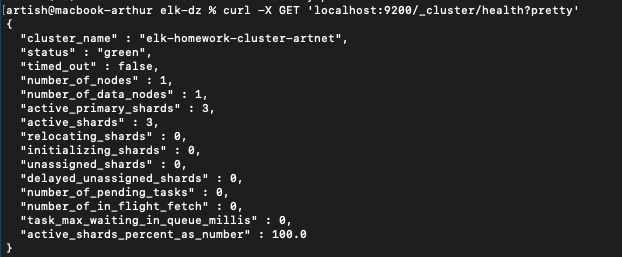

# Домашнее задание: ELK (Elasticsearch, Logstash, Kibana)

## Задание 1: Elasticsearch

- Поднят Elasticsearch в Docker через `docker-compose`
- Установлен уникальный `cluster_name`: `elk-homework-cluster-artnet`
- Elasticsearch успешно запущен и отвечает на запросы

### Проверка кластера:

bash
curl -X GET 'localhost:9200/_cluster/health?pretty'

### Скриншот результата

